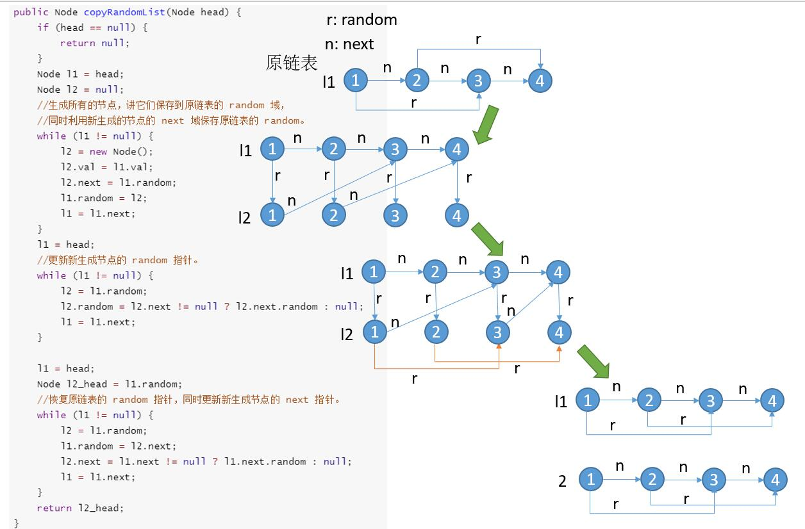

# Insertion
## At the front
```c++
void push(Node** head_ref, int new_data) 
{ 
    Node* new_node = new Node(); 
    new_node->data = new_data; 
    new_node->next = (*head_ref); 
    (*head_ref) = new_node; 
} 
```
At the end of list
```c++
void append(Node** head_ref, int new_data)  
{  
    Node* new_node = new Node(); 
    Node *last = *head_ref; 
    new_node->data = new_data; 
    new_node->next = NULL;
    if (*head_ref == NULL)  
    {  
        *head_ref = new_node;  
        return;  
    }  
    while (last->next != NULL)  
        last = last->next;  
    last->next = new_node;  
    return;  
}  
```
Insert after
```c++
void insertAfter(Node* prev_node, int new_data)  
{
    if (prev_node == NULL)  
    {  
        cout << "the given previous node cannot be NULL";  
        return;  
    } 
    Node* new_node = new Node(); 
    new_node->data = new_data;
    new_node->next = prev_node->next;
    prev_node->next = new_node;  
} 
```
---
## To swap 2 nodes in a linked list
```c++
void swapNodes(Node** head_ref, int x, int y)
{
    //1) Nothing to do if x and y are same
    if (x == y)
        return;
    // 2)Search for x (keep track of prevX and CurrX
    Node *prevX = NULL, *currX = *head_ref;
    while (currX && currX->data != x) {
        prevX = currX;
        currX = currX->next;
    }
    // 3)Search for y (keep track of prevY and CurrY
    Node *prevY = NULL, *currY = *head_ref;
    while (currY && currY->data != y) {
        prevY = currY;
        currY = currY->next;
    }
    // 4)If either x or y is not present, nothing to do
    if (currX == NULL || currY == NULL)
        return;
    // 5) If x is not head of linked list
    if (prevX != NULL)
        prevX->next = currY;
    else // 6) Else make y as new head
        *head_ref = currY;
    // 7) If y is not head of linked list
    if (prevY != NULL)
        prevY->next = currX;
    else // 8) Else make x as new head
        *head_ref = currX;
    // 9) Swap next pointers
    Node* temp = currY->next;
    currY->next = currX->next;
    currX->next = temp;
}
```
there are 4 cases to be checked here
```
x and y may or may not be adjacent. 
Either x or y may be a head node. 
Either x or y may be the last node. 
x and/or y may not be present in the linked list.
```
***
## Reverse a linked list

```c++
    ListNode* mergeTwoLists(ListNode* l1, ListNode* l2) {
        ListNode* res=new ListNode(-1);
        ListNode* temp=res;//to traverse
        if(!l1)return l2;
        if(!l2)return l1;
        while(l1!=NULL&&l2!=NULL){
        	if(l1->val<l2->val){
        		temp->next=l1;
        		l1=l1->next;
        		temp=temp->next;//here res is same but temp changes
        	}else{
        		temp->next=l2;
        		l2=l2->next;
        		temp=temp->next;
        	}
        }
        if(l1!=NULL)temp->next=l1;
        if(l2!=NULL)temp->next=l2;
        res=res->next;
        return res;
    }
```

make a dummy node which connects to one which is smaller
```cpp
    ListNode* merge(ListNode* l1,ListNode* l2){
     if(l1==NULL)return l2;
     if(l2==NULL)return l1;
     if(l1->val<l2->val){
     	l1->next=merge(l1->next,l2);
     	return l1;
     }else{
     	l2->next=merge(l2->next,l1);
     	return l2;
     }
    }
```
- recursion using `->next` of lower value

---
Deep copy a linked list
---

```c++
Node* copyRandomList(Node* head) {
        Node* curr=head;
        if(head==NULL)return head;
        while(curr!=NULL)
        {
            Node* copy=new Node(curr->val);
            copy->next=curr->next;
            curr->next=copy;
            curr=curr->next->next;
        }
        curr=head;
        while(curr!=NULL)
        {
            if(curr->random!=NULL)
            curr->next->random=curr->random->next;
            curr=curr->next->next;
        }
        curr=head;
        Node* ret=curr->next;
        Node* copy=curr->next;
        while (curr != nullptr)
        {
            copy = curr->next;
            curr->next = copy->next;
            curr = curr->next;
            if (curr)
                copy->next = curr->next;
        }
        return ret;
    }
```
---
# delete nth node in linked list
```cpp
    ListNode* removeNthFromEnd(ListNode* head, int n) {
                ListNode* fast=head,*slow=head,*prev;
                for(int i=1;i<n;i++){
                    fast=fast->next;
                }
                if(fast->next==NULL) //if ele to be removed is head
                    return head->next;
                while(fast->next!=NULL){
                    prev=slow;
                    fast=fast->next;
                    slow=slow->next;
                }
                prev->next=slow->next;
                return head;
    }
```
- here slow will be end in nth last ele
- so to remove and make slow land one ele before we can do fast=fast->next;
```cpp
    ListNode* removeNthFromEnd(ListNode* head, int n) {
                ListNode* fast=head,*slow=head,*prev;
                for(int i=1;i<n;i++){
                    fast=fast->next;
                }
                if(fast->next==NULL) //if ele to be removed is head
                    return head->next;
                fast=fast->next;
                while(fast->next!=NULL){
                    fast=fast->next;
                    slow=slow->next;
                }
                slow->next=slow->next->next;
                return head;
    }
```
---
# detect cycle
```cpp
    bool hasCycle(ListNode *head) {
        ListNode* fast=head,*slow=head;
        if(head==NULL||head->next==NULL)return false;
        fast=fast->next;//as head->next!=NULL
        while(fast->next!=NULL){
        //while(fast->next!=NULL&&fast->next->next==NULL)//to reduce what is done below as we if null its false as it has end
            fast=fast->next;
            if(fast==slow)return true;
            slow=slow->next;
            if(fast->next==NULL)break;
            fast=fast->next;
        }
        return false;
    }
```
---
# detect the intersection of 2 linked list
```cpp
    ListNode *getIntersectionNode(ListNode *headA, ListNode *headB) {
        if(headA==NULL||headB==NULL)return NULL;
        ListNode* ptrA=headA,*ptrB=headB;
        while(ptrA!=ptrB){  //ptrA and ptrB==NULL or they are same so intersection point
            ptrA=ptrA==NULL?headB:ptrA->next;//if ptr A null connect it to start B
            ptrB=ptrB==NULL?headA:ptrB->next;
        }
        return ptrA;
    }
```

- can use count of nodes too as except the end all are diff so from point of intersection so if one is more than another move the one which is bigger forward by that many times then start
- can use hash map too but take o(n) space

---
# 
```cpp
    ListNode* reverseKGroup(ListNode* head, int k) {
        ListNode* dummy= new ListNode(-1);
        if(head==NULL||k==1)return head;
        int count=0;
        ListNode* temp=head;
        //count number of nodes
        while(temp!=NULL){
        	temp=temp->next;
        	count++;
        }
        ListNode *next,*pre=dummy,*curr=head;
        pre->next=head;
        while(count>=k){ //to makes sure if k more than count then no need for swapping
        	curr=pre->next;
        	next=curr->next;
        	for(int i=1;i<k;i++){
                //k-1 swaps of direction
        		curr->next=next->next;
        		next->next=pre->next;
        		pre->next=next;
        		next=curr->next;
        	}
        	pre=curr; //when we chang pre here dummy is pointing at kth node and then pre changes to curr
        	count=count-k;
       }
        return dummy->next;
    }
``` 


---
# check if linklist is palindrome
```cpp
    ListNode* linklistrev(ListNode* head){
    	ListNode* pre=NULL,*next,*curr=head;
    	while(curr!=NULL){
    		next=curr->next;
    		curr->next=pre;
    		pre=curr;
    		curr=next;
    	}
    	return pre;
    }
    bool isPalindrome(ListNode* head) {
        ListNode* slow=head;ListNode* fast=head;int count=1;
        if(head==NULL||head->next==NULL)return true;
        while(fast->next!=NULL){
        	fast=fast->next;
        	if(fast->next==NULL){ 
                //keep slow at left side of even
        		break;
        	}
        	slow=slow->next;
            count++;
        	fast=fast->next;
        }
        fast=linklistrev(slow);
        slow=head;
        for(int i=0;i<count;i++){
        	if(slow->val!=fast->val)return false;
        	fast=fast->next;
        	slow=slow->next;
        }
        return true;
    }
```
```
1 -> 2 -> 3 -> 4 -> 5 -> 6
slow = 3
fast=6
count=3
change this to so reverse from 3 as head
1 -> 2 -> 3 <- 4 <- 5 <- 6 
fast=6
slow=1
check 3 times - > (1,6) -> (2,5) -> (3,3)
```
---
# find the position of cycle
```cpp
    ListNode *detectCycle(ListNode *head) {
     if(head==NULL||head->next==NULL)return NULL;
     ListNode* slow=head,*fast=head;
     while(fast->next!=NULL&&fast->next->next!=NULL){//as in cycle there is no NULL so if there is NULL it doesnt have cycle
     	fast=fast->next->next;
        slow=slow->next;
     	if(fast==slow){
     		fast=head;
		     while(fast!=slow){
		     	fast=fast->next;
		     	slow=slow->next;   
		     }
            return fast;
     	}
     }   
     return NULL;
    }
```


---
# merge k sorted lists
```
You are given an array of k linked-lists lists, each linked-list is sorted in ascending order.

Merge all the linked-lists into one sorted linked-list and return it.
```
```
Input: lists = [[1,4,5],[1,3,4],[2,6]]
Output: [1,1,2,3,4,4,5,6]
Explanation: The linked-lists are:
[
  1->4->5,
  1->3->4,
  2->6
]
merging them into one sorted list:
1->1->2->3->4->4->5->6
```
```cpp
struct compare {
    bool operator()(const ListNode* l, const ListNode* r) {
        return l->val > r->val;
    }
};
    
public:
ListNode *mergeKLists(vector<ListNode *> &lists) {
    priority_queue<ListNode *, vector<ListNode *>, compare> q;
    for (auto l : lists) {
        if (l) {
            q.push(l);
        }
    }
    if (q.empty()) {
        return NULL;
    }
    ListNode* result = q.top();
    q.pop();
    if (result->next) {
        q.push(result->next);
    }

    ListNode* tail = result;            
    while (!q.empty()) {
        tail->next = q.top();
        q.pop();
        tail = tail->next;
        if (tail->next) {
            q.push(tail->next);
        }
    }
    
    return result;
}
```
---
# flatten linked list

```cpp
Node* merge(Node* l1,Node* l2){
	if(!l1)return l2;
	if(!l2)return l1;
	Node* res=new Node(-1);
	Node* temp=res;
	while(l1!=NULL&&l2!=NULL){
		if(l1->data<l2->data){
			temp->bottom=l1;
			l1=l1->bottom;
			temp=temp->bottom;
		}else{
			temp->bottom=l2;
			l2=l2->bottom;
			temp=temp->bottom;
		}
	}
	if(l1)temp->bottom=l1;
	if(l2)temp->bottom=l2;
	return res->bottom;
}
Node *flatten(Node *root)
{
   if(root==NULL||root->next==NULL)return root;//unless last ele or null
   root->next=flatten(root->next);
   root=merge(root,root->next);
   return root;
}
```
```
in the above if 
1 -> 2 -> 3 -> 4
recursion stops at 4 as 4 last ele returns 4
3->next = 4
3=merge(3,4)
return 3
2->next = 3
2=merge(2,3)
return 2
1->next=2
1=merge(1,2)
return 1
```

---
# Rotate a linked list

```cpp
    ListNode* rotateRight(ListNode* head, int k) {
        if(head==NULL||head->next==NULL)return head;
        ListNode *curr=head;
        int len=1;
        while(curr->next!=NULL){ //find end of linked list
        	curr=curr->next;
        	len++;
        }
        curr->next=head; 
        k=k%len;
        k=len-k;
        while(k){
        	curr=curr->next;
        	k--;
        }
        head=curr->next;
        curr->next=NULL;
        return head; 
    }
```
```
1 -> 2 -> 3 -> 4 -> 5  => 4 -> 5 -> 1 -> 2 -> 3 for k=2
go to 5
do 5->1 connect tail to head
given if k=2 k=k%len=2%5=2   for k>len
k=len=k =3
go forward from head len-k times so go to 3
make 3->next head so head = 4
make 3->next = NULL 
```

---