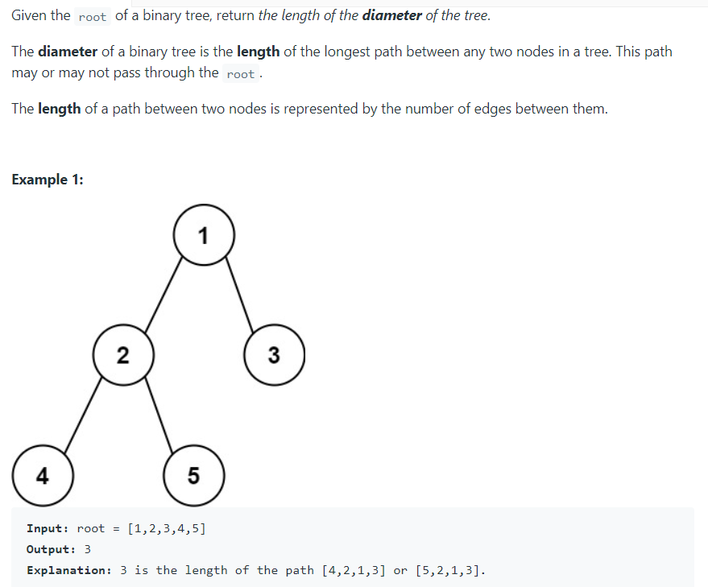

# TREE
## BST
***
### NEWNODE CREATION
``` C++
Node* newnode(int key)
{
    Node* node =new Node;
    node->left=NULL;
    node->right=NULL;
    node->key=key;
    return node;
}
```
---
### INSERTION
``` C++
BST* BST ::Insert(BST* root, int value)
{
    if (!root)
    {
        // Insert the first node, if root is NULL.
        return new BST(value);
    }
 
    // Insert data.
    if (value > root->data)
    {
        // Insert right node data, if the 'value'
        // to be inserted is greater than 'root' node data.
 
        // Process right nodes.
        root->right = Insert(root->right, value);
    }
    else
    {
        // Insert left node data, if the 'value'
        // to be inserted is greater than 'root' node data.
 
        // Process left nodes.
        root->left = Insert(root->left, value);
    }
 
    // Return 'root' node, after insertion.
    return root;
}
```
---
### SEARCHING
``` c++
Node* BstSearch(Node* root,int key)
{
    Node* curr=root;
    Node* par=NULL;
    while(curr!=NULL)
    {
        par=curr;
        if(par->key==key)
        return par;
        if(key<curr->key)
        {
            curr=curr->left;
        }
        else
        curr=curr->right;
    }
    return NULL;
}
```
---
# deletion of node
```cpp
struct node* deleteNode(struct node* root, int key)
{
    // base case
    if (root == NULL)
        return root;
 
    // If the key to be deleted is
    // smaller than the root's
    // key, then it lies in left subtree
    if (key < root->key)
        root->left = deleteNode(root->left, key);
 
    // If the key to be deleted is
    // greater than the root's
    // key, then it lies in right subtree
    else if (key > root->key)
        root->right = deleteNode(root->right, key);
 
    // if key is same as root's key, then This is the node
    // to be deleted
    else {
        // node has no child
        if (root->left==NULL and root->right==NULL)
            return NULL;
       
        // node with only one child or no child
        else if (root->left == NULL) {
            struct node* temp = root->right;
            free(root);
            return temp;
        }
        else if (root->right == NULL) {
            struct node* temp = root->left;
            free(root);
            return temp;
        }
 
        // node with two children: Get the inorder successor
        // (smallest in the right subtree)
        struct node* temp = minValueNode(root->right);
 
        // Copy the inorder successor's content to this node
        root->key = temp->key;
 
        // Delete the inorder successor
        root->right = deleteNode(root->right, temp->key);
    }
    return root;
}
 
```
- 1 -> deleted node is leaf node return NULL
- 2 -> deleted node has one child return child
- 3 -> deleted node has 2 childs find inorder successor i.e min of right 
---
TRAVERSAL
```c++
void printPostorder(struct Node* node)
{
    if (node == NULL)
        return;
 
    // first recur on left subtree
    printPostorder(node->left);
 
    // then recur on right subtree
    printPostorder(node->right);
 
    // now deal with the node
    cout << node->data << " ";
}
 
/* Given a binary tree, print its nodes in inorder*/
void printInorder(struct Node* node)
{
    if (node == NULL)
        return;
 
    /* first recur on left child */
    printInorder(node->left);
 
    /* then print the data of node */
    cout << node->data << " ";
 
    /* now recur on right child */
    printInorder(node->right);
}
 
/* Given a binary tree, print its nodes in preorder*/
void printPreorder(struct Node* node)
{
    if (node == NULL)
        return;
 
    /* first print data of node */
    cout << node->data << " ";
 
    /* then recur on left sutree */
    printPreorder(node->left);
 
    /* now recur on right subtree */
    printPreorder(node->right);
}
```
---
Level order Traversal
```c++
void printLevelOrder(Node *root)
{
    // Base Case
    if (root == NULL)  return;
 
    // Create an empty queue for level order traversal
    queue<Node *> q;
 
    // Enqueue Root and initialize height
    q.push(root);
 
    while (q.empty() == false)
    {
        // Print front of queue and remove it from queue
        Node *node = q.front();
        cout << node->data << " ";
        q.pop();
 
        /* Enqueue left child */
        if (node->left != NULL)
            q.push(node->left);
 
        /*Enqueue right child */
        if (node->right != NULL)
            q.push(node->right);
    }
}
```
---
height of a tree
```c++
int height(node* node)
{
    if (node == NULL)
        return 0;
    else
    {
        /* compute the height of each subtree */
        int lheight = height(node->left);
        int rheight = height(node->right);
 
        /* use the larger one */
        if (lheight > rheight)
            return(lheight + 1);
        else return(rheight + 1);
    }
}
```
---
Diameter of a tree


```c++
   int solve(TreeNode* root,int& res)
   {
       if(root==NULL)
           return 0;
       int l=solve(root->left,res);
       int r=solve(root->right,res);
       int temp = max(l,r);
       int ans=l+r;
       res=max(res,ans);
       return temp+1;
   }
    int diameterOfBinaryTree(TreeNode* root) {
        int res=INT_MIN;
       solve(root,res);
        return res;
    }
```
---
inorder traversal without recursion
```c++
vector<int> inorderTraversal(TreeNode* root) {
        stack<TreeNode*> st;
        TreeNode* curr=root;
        vector<int> ret;
        while(curr!=NULL||st.empty()!=true)
        {
            
            while(curr!=NULL)
            {
                st.push(curr);
                curr=curr->left;
            }
            ret.push_back(st.top()->val);
            curr=st.top();
            st.pop();
            curr=curr->right;
           
            }
             return ret;
    }
```

---
preorder without rec
```c++
void iterativePreorder(node* root)
{
    // Base Case
    if (root == NULL)
        return;
 
    // Create an empty stack and push root to it
    stack<node*> nodeStack;
    nodeStack.push(root);
 
    /* Pop all items one by one. Do following for every popped item
       a) print it
       b) push its right child
       c) push its left child
    Note that right child is pushed first so that left is processed first */
    while (nodeStack.empty() == false) {
        // Pop the top item from stack and print it
        struct node* node = nodeStack.top();
        printf("%d ", node->data);
        nodeStack.pop();
 
        // Push right and left children of the popped node to stack
        if (node->right)
            nodeStack.push(node->right);
        if (node->left)
            nodeStack.push(node->left);
    }
}
```
---
## iterative postorder
```cpp
void postorderIterative(Node* root)
{
    stack<Node*> s;
    s.push(root);
 
    // create another stack to store postorder traversal
    stack<int> out;
    while (!s.empty())
    {
        Node* curr = s.top();
        s.pop();
 
        out.push(curr->data);
        if (curr->left) {
            s.push(curr->left);
        }
 
        if (curr->right) {
            s.push(curr->right);
        }
    }
 
    // print postorder traversal
    while (!out.empty())
    {
        cout << out.top() << " ";
        out.pop();
    }
}
```

---
Clone binary tree
---
```c++
    Node* createClone(Node* root,unordered_map<Node*,Node*> &mp)//to recurse untill dclone is made
    {
        if(root==NULL)return root;
        mp[root]=new Node(root->data);
        mp[root]->left=createClone(root->left,mp);
         mp[root]->right=createClone(root->right,mp);
         return mp[root];
    }
    void randomden(Node* root,unordered_map<Node*,Node*> &mp)//to equate random pointers to clone
    {
        if(root==NULL)return;
        mp[root]->random=mp[root->random];
        randomden(root->left,mp);
        randomden(root->right,mp);
    }
    Node* cloneTree(Node* tree)
    {
        if(tree==NULL)return tree;
       unordered_map<Node*,Node*> mp;
       mp[tree]=createClone(tree,mp);
       randomden(tree,mp);
       Node* root = mp[tree];
       return root;
       
    }
```
---
## constructing tree from inorder and preorder
```c++
    TreeNode* helper(int ins,int ine,int pres,int pree,vector<int> preorder,vector<int> inorder)
    {
        if(ins>ine)return NULL;
        TreeNode* root=new TreeNode(preorder[pres]);
        int rootindex;
        for(int i=ins;i<=ine;i++)
        {
            if(root->val==inorder[i])
            {
                rootindex=i;
                break;
            }
        }
        int lins=ins;  // inorder left ->| | | | root| | | | | <-right
        int line=rootindex-1;   
        int lpres=pres+1;    //  |root| left | right|  preorder
        int lpree=line-lins+lpres;
        int rins=rootindex+1;
        int rine=ine;
        int rpres=lpree+1;
        int rpree=pree;
        root->left=helper(lins,line,lpres,lpree,preorder,inorder);
        root->right=helper(rins,rine,rpres,rpree,preorder,inorder);
        return root;
    }
    TreeNode* buildTree(vector<int>& preorder, vector<int>& inorder) {
        
        TreeNode* root=helper(0,inorder.size()-1,0,preorder.size()-1,preorder,inorder);
        return root;
    }
```
- find the length of left tree in inorder =inorder end - inorder start 
- so left pre order end =left preorder start + length of inorder left
---
# Max No of nodes in a level
```c++
int widthOfBinaryTree(TreeNode* root) {
        queue<TreeNode*> q;
        q.push(root);
        int count=0;int maxw=INT_MIN;
        while(!q.empty())
        {
         count = q.size();
           maxw=max(maxw,count);
            while(count!=0)
            {
                TreeNode* temp=q.front();
                q.pop();
                if(temp->left)
                    q.push(temp->left);
                if(temp->right)
                    q.push(temp->right);
                count--;
            }
            
        }
        return maxw+1;
        
    }
```
---
> # width of tree (count null too)
```c++
    int widthOfBinaryTree(TreeNode* root) {
        queue<pair<TreeNode*,double>> q;
        q.push({root,0});                                                     //     0
        double maxw=INT_MIN;double curr;            //                             /  \
        while(!q.empty())                             //                   (2*0) 0      1 (2*0+1)  =1-0+1=2
        {                                                         //            / |    / \ 
            double first=q.front().second;                  //                 0 nullnull 3  =>3-0+1=4
            curr=0;                                    //                     / \ /\   /\ /\
            int s=q.size();                             //                   0  n n n n n n 7=>7-0+1=8(count null too)
            for(int i=0;i<s;i++)
            {
                curr=q.front().second;

                pair<TreeNode*,double> temp=q.front();
                q.pop();
                if(temp.first->left)
                    q.push({temp.first->left,temp.second*2});
                if(temp.first->right)
                    q.push({temp.first->right,temp.second*2+1});
                
            }
            maxw=max(maxw,curr-first+1);
        }
        return maxw;
    }
```
---
> ## all nodes distance k in a binary tree
approach bfs with hash map and set
```c++
    vector<int> list;
    unordered_map<TreeNode*,TreeNode*> parent; //for going to parent
    unordered_set<TreeNode*> set;             //to check if you have visited a node
    void hashingTree(TreeNode* root)
    {
        if(root->left)
        {
            parent[root->left]=root;
            hashingTree(root->left);
        }
        if(root->right)
        {
            parent[root->right]=root;
            hashingTree(root->right);
        }
    }
    vector<int> distanceK(TreeNode* root, TreeNode* target, int K) {
        hashingTree(root);
        queue<TreeNode*> q;
        q.push(target);
        set.insert(target);
        while(!q.empty()&&K!=0)
        {
           int c=q.size(); 
        for(int i=0;i<c;i++)
        {
            TreeNode* temp;
            temp=q.front();
            q.pop();

            if(temp->left&&set.find(temp->left)==set.end())
            {
                q.push(temp->left);
                set.insert(temp->left);
            }
            if(temp->right&&set.find(temp->right)==set.end())
            {
                q.push(temp->right);
                set.insert(temp->right);
            }
            if(parent[temp]&&set.find(parent[temp])==set.end())
            {
                q.push(parent[temp]);
                set.insert(parent[temp]);
            }
            
        }
        K--;
        }
        while(!q.empty())
        {
            list.push_back(q.front()->val);
            q.pop();
        }
        return list;
    } 
```
without hashing

>you make a recursive call from head to target ,if you reach `target` return 1 
```cpp
    private int dfs(List<Integer> res, TreeNode node, int target, int K, int depth) {
        if (node == null) return 0;
        
        if (depth == K) {  
            res.add(node.val);
            return 0;
        }
        
        int left, right;
        if (node.val == target || depth > 0) {  
            //if it is target do dfs with depth + 1 as at target it is 1
            //if it is node at a depth above target so do dfs on them as you are in the other child of parent of target
            left = dfs(res, node.left, target, K, depth + 1);
            right = dfs(res, node.right, target, K, depth + 1);
        } else {
            //when you havent found target
            left = dfs(res, node.left, target, K, depth);
            right = dfs(res, node.right, target, K, depth);
        }
        
        if (node.val == target) return 1; //if target present then return 1 so then we can make sure it is in its left or right subchild
        
        if (left == K || right == K) {  //left ==k mean we are k distance from target
            res.add(node.val);
            return 0;
        }
        
        if (left > 0) { //else go to other child and parent by return 
            dfs(res, node.right, target, K, left + 1);
            return left + 1;
        }
        
        if (right > 0) {
            dfs(res, node.left, target, K, right + 1); //going to other child
            return right + 1; //going to parent by inc depth if right=1 means it is distance 1 from target so its parent is 1+1 =2 distance 2 form target
        } 
        
        return 0;
    }
```
---
# to print all ancestors of a tree
```c++
bool printAncestors(struct node *root, int target)
{
  /* base cases */
  if (root == NULL)
     return false;
  
  if (root->data == target)
     return true;
  
  /* If target is present in either left or right subtree of this node,
     then print this node */
  if ( printAncestors(root->left, target) ||
       printAncestors(root->right, target) )
  {
    cout << root->data << " ";
    return true;
  }
  
  /* Else return false */
  return false;
}
```
---
# Lowest common ancestor of a binary tree
```c++
 TreeNode* lowestCommonAncestor(TreeNode* root, TreeNode* p, TreeNode* q) {
        if(root==NULL)
            return NULL;
        if(root==p||root==q)
            return root;
        TreeNode* left=lowestCommonAncestor(root->left,p,q);
        TreeNode* right=lowestCommonAncestor(root->right,p,q);
        if(left==NULL)return right;
        if(right==NULL)return left;
        return root;
        }
```
# to check if binary tree is symmetric 
```c++
bool helper(TreeNode* root,TreeNode* root1)
    {

        if(root1==NULL&&root==NULL)return true;//to check if both are NULL
        if(root1==NULL||root==NULL)return false; //to check if one of them is NULL as we have removed the case of both are NULL
        if(root1->val!=root->val)
        {
            return false; 
        }
        
        if(helper(root->left,root1->right)&&helper(root->right,root1->left))
        {
            return true;
        }
        return false;
    }
    bool isSymmetric(TreeNode* root) {
       return helper(root->left,root->right);
               
    }
};
```
# to check if a tree is a subtree of another tree
```c++
    bool checkIsIdentical(TreeNode* root,TreeNode* sub)
    {
        if(root==NULL&&sub==NULL)
            return true;
        if(root==NULL||sub==NULL)
            return false;
        if(root->val!=sub->val)
            return false;
        return checkIsIdentical(root->left,sub->left)&&checkIsIdentical(root->right,sub->right);
    }
    bool isSubtree(TreeNode* root, TreeNode* subRoot) {
        if(subRoot==NULL)
            return true;
        if(root==NULL)
            return false;
        if(checkIsIdentical(root,subRoot))
            return true;
        return isSubtree(root->left,subRoot)||isSubtree(root->right,subRoot);
    }
```
---
> #  Populating Next Right Pointers in Each Node

```c++
    Node* connect(Node* root) {
         if (!root) return root;
        queue<Node*> q;
        q.push(root);
        while (!q.empty()) {
            int size = q.size();
            for (int i = 0; i < size; i++) {
                Node* node = q.front();
                q.pop();
                if (i != size - 1) {
                    node->next = q.front();
                }
                
                if (node->left)
                    q.push(node->left);
                if (node->right)
                    q.push(node->right);
            }
        }
        return root;
    }
```
without queue
```cpp
    Node* connect(Node* root) { 
        if(!root)return NULL;
        Node* tmp=root;
        while(root->left){
            Node* p=root;
            while(p){
                p->left->next=p->right;
                if(p->next)
                    p->right->next=p->next->left;
                p=p->next;
            }
            root=root->left;
        }
        return tmp;
    }
```
---
# right view of binary tree
```c++
 vector<int> list;
    vector<int> rightSideView(TreeNode* root) {
        queue<TreeNode*> q;
        if(root==NULL)return list;
        q.push(root);
        while(!q.empty()){
            int c=q.size();
            list.push_back(q.front()->val);
            for(int i=0;i<c;i++)
            {
                TreeNode* temp=q.front();
                q.pop();
                if(temp->right)
                    q.push(temp->right);
                if(temp->left)
                    q.push(temp->left);
            }
        }
        return list;
    }
```
left view just push left side first in bfs

---
# boundry traversal

```c++
    // Utility function to check if a given node is a leaf node
    bool isLeaf() {
        return this->left == nullptr && this->right == nullptr;
    }
};
 
// Recursive function to print the left boundary of the given binary tree
// in a top-down fashion, except for the leaf nodes
void printLeftBoundary(Node* root)
{
    Node* node = root;
 
    // do for all non-leaf nodes
    while (!node->isLeaf())
    {
        // print the current node
        cout << node->data << ' ';
 
        // next process, the left child of `root` if it exists;
        // otherwise, move to the right child
        node = (node->left) ? node->left: node->right;
    }
}
 
// Recursive function to print the right boundary of the given binary tree
// in a bottom-up fashion, except for the leaf nodes
void printRightBoundary(Node* root)
{
    // base case: root is empty, or root is a leaf node
    if (!root || root->isLeaf()) {
        return;
    }
 
    // recur for the right child of `root` if it exists;
    // otherwise, recur for the left child
    printRightBoundary(root->right ? root->right: root->left);
 
    // To ensure bottom-up order, print the value of the nodes
    // after recursion unfolds
    cout << root->data << ' ';
}
 
// Recursive function to print the leaf nodes of the given
// binary tree in an inorder fashion
void printLeafNodes(Node* root)
{
    // base case
    if (root == nullptr) {
        return;
    }
 
    // recur for the left subtree
    printLeafNodes(root->left);
 
    // print only leaf nodes
    if (root->isLeaf()) {
        cout << root->data << ' ';
    }
 
    // recur for the right subtree
    printLeafNodes(root->right);
}
 
// Function to perform the boundary traversal on a given tree
void performBoundaryTraversal(Node* root)
{
    // base case
    if (root == nullptr) {
        return;
    }
 
    // print the root node
    cout << root->data << ' ';
 
    // print the left boundary (except leaf nodes)
    printLeftBoundary(root->left);
 
    // print all leaf nodes
    if (!root->isLeaf()) {
        printLeafNodes(root);
    }
 
    // print the right boundary (except leaf nodes)
    printRightBoundary(root->right);
}
```
---
# serialize and deserialize a tree
```c++
// Encodes a tree to a single string.
    string serialize(TreeNode* root) {
        if (root == nullptr) return "#";
        return to_string(root->val)+","+serialize(root->left)+","+serialize(root->right);
    }

    // Decodes your encoded data to tree.
    TreeNode* deserialize(string data) {
        return mydeserialize(data);
    }
    TreeNode* mydeserialize(string& data) {
        if (data[0]=='#') {
            if(data.size() > 1) data = data.substr(2);
            return nullptr;
        } else {
            TreeNode* node = new TreeNode(helper(data));
            node->left = mydeserialize(data);
            node->right = mydeserialize(data);
            return node;
        }
    }
private:
    int helper(string& data) {
        int pos = data.find(',');
        int val = stoi(data.substr(0,pos));
        data = data.substr(pos+1);
        return val;
    }
```
---
#  inorder predecessor
```c++
    TreeNode* findMax(TreeNode* root)
    {
        while(root->right)
        {
            root=root->right;
        }
        return root;
    }
    TreeNode * inorderPredecessor(TreeNode * root, TreeNode * p) {
        if(root==NULL)return root;
        if(root->val==p->val)
        {
            prec=findMax(root->left);
            return prec;
        }
        if(root->val>p->val)
        {
            return inorderPredecessor(root->left,p);
        }
        else
        return inorderPredecessor(root->right,p)
    }
```
iterative
```c++
Node* findMaximum(Node* root)
{
    while (root->right) {
        root = root->right;
    }
 
    return root;
}
 
// Iterative function to find inorder predecessor for a given key in a BST
Node* findPredecessor(Node* root, int key)
{
    Node* prec = nullptr;
 
    while (1)
    {
        // if the given key is less than the root node, visit the left subtree
        if (key < root->data) {
            root = root->left;
        }
 
        // if the given key is more than the root node, visit the right subtree
        else if (key > root->data)
        {
            // update predecessor to the current node before visiting
            // right subtree
            prec = root;
            root = root->right;
        }
 
        // if a node with the desired value is found, the predecessor is the maximum
        // value node in its left subtree (if any)
        else {
            if (root->left) {
                prec = findMaximum(root->left);
            }
            break;
        }
 
        // if the key doesn't exist in the binary tree
        if (!root) {
            return nullptr;
        }
    }
 
    // return predecessor, if any
    return prec;
}
```
---
# successor in a BST
```c++
Node* findMinimum(Node* root)
{
    while (root->left) {
        root = root->left;
    }
 
    return root;
}
 
// Recursive function to find an inorder successor for the given key in a BST.
// Note that successor `succ` is passed by reference to the function
void findSuccessor(Node* root, Node*& succ, int key)
{
    // base case
    if (root == nullptr)
    {
        succ = nullptr;
        return;
    }
 
    // if a node with the desired value is found, the successor is the minimum value
    // node in its right subtree (if any)
    if (root->data == key)
    {
        if (root->right) {
            succ = findMinimum(root->right);
        }
    }
    // if the given key is less than the root node, recur for the left subtree
    else if (key < root->data)
    {
        // update successor to the current node before recursing in the left subtree
        succ = root;
        findSuccessor(root->left, succ, key);
    }
 
    // if the given key is more than the root node, recur for the right subtree
    else {
        findSuccessor(root->right, succ, key);
    }
}
```
---
# IsBST
```c++
    bool helper(TreeNode* root,long minkey,long maxkey)
    {
        if(root==NULL)
            return true;
        if(root->val<=minkey||root->val>=maxkey)
            return false;
        return helper(root->left,minkey,root->val)&&helper(root->right,root->val,maxkey);
    }
    bool isValidBST(TreeNode* root) {
        return helper(root,LONG_MIN, LONG_MAX);
    }
```
iterative approach
```c++
public boolean isValidBST(TreeNode root) {
   if (root == null) return true;
   Stack<TreeNode> stack = new Stack<>();
   TreeNode pre = null;
   while (root != null || !stack.isEmpty()) {           //we check 
      while (root != null) {    //go till the leftmost node
         stack.push(root);
         root = root.left;
      }
      root = stack.pop();//check if this is lesser than root below it
      if(pre != null && root.val <= pre.val) return false;      //null because first time prev is null
      pre = root;
      root = root.right;
   }
   return true;
}
```
---
# 
```cpp
struct Node *findLCA(struct Node* root, int n1, int n2)
{
    // Base case
    if (root == NULL) return NULL;
 
    // If either n1 or n2 matches with root's key, report
    // the presence by returning root (Note that if a key is
    // ancestor of other, then the ancestor key becomes LCA
    if (root->key == n1 || root->key == n2)
        return root;
 
    // Look for keys in left and right subtrees
    Node *left_lca  = findLCA(root->left, n1, n2);
    Node *right_lca = findLCA(root->right, n1, n2);
 
    // If both of the above calls return Non-NULL, then one key
    // is present in once subtree and other is present in other,
    // So this node is the LCA
    if (left_lca && right_lca)  return root;
 
    // Otherwise check if left subtree or right subtree is LCA
    return (left_lca != NULL)? left_lca: right_lca;
}
```


---
# distance between 2 nodes in bunary tree
```cpp
Node* LCA(Node * root, int n1,int n2)
{
    // Your code here
    if (root == NULL)
       return root;
    if (root->key == n1 || root->key == n2)
       return root;
 
    Node* left = LCA(root->left, n1, n2);
    Node* right = LCA(root->right, n1, n2);
 
    if (left != NULL && right != NULL)
         return root;
    if (left == NULL && right == NULL)
           return NULL;
    if (left != NULL)
        return LCA(root->left, n1, n2);
 
    return LCA(root->right, n1, n2);
}
 
// Returns level of key k if it is present in
// tree, otherwise returns -1
int findLevel(Node *root, int k, int level)
{
    if(root == NULL) return -1;
    if(root->key == k) return level;
 
    int left = findLevel(root->left, k, level+1);
   if (left == -1)
       return findLevel(root->right, k, level+1);
    return left;
}
 
int findDistance(Node* root, int a, int b)
{
    // Your code here
    Node* lca = LCA(root, a , b);
 
    int d1 = findLevel(lca, a, 0);
    int d2 = findLevel(lca, b, 0);
 
    return d1 + d2;
}
```
- find lca and 
- then find at what level each one is 
- then add them
---
# lowest common ancestor of a binary search tree
```c++
TreeNode* lowestCommonAncestor(TreeNode* root, TreeNode* p, TreeNode* q) {
        if(root->val>max(p->val,q->val))
            return lowestCommonAncestor(root->left,p,q);
        else if(root->val<min(p->val,q->val))
            return lowestCommonAncestor(root->right,p,q);
        else 
            return root;
    }
```
---
# kth smallest element in a binary search tree
```c++
 void  helper(TreeNode* root,int k,int arr[])
    {
        if(root==NULL)
            return;
        helper(root->left,k,arr);
        arr[0]++;
        if(arr[0]==k)
        {
            arr[1]=root->val;
            return;
        }
            helper(root->right,k,arr);
    }
    int kthSmallest(TreeNode* root, int k) {
        int arr[2];
        arr[0]=0;
        helper(root,k,arr);
        return arr[1];
    }
```
---
Merge 2 Binary trees

```c++
TreeNode* mergeTrees(TreeNode* root1, TreeNode* root2) {
        if(root1==NULL||root2==NULL)
            return root1==NULL?root2:root1;
        int val=((root1==NULL)?0:root1->val)+((root2==NULL)?0:root2->val);
        TreeNode* root=new TreeNode(val);
        root->left=mergeTrees(root1==NULL?NULL:root1->left,root2==NULL?NULL:root2->left);
        root->right=mergeTrees(root1==NULL?NULL:root1->right,root2==NULL?NULL:root2->right);
        return root;
    }
```
---
# Recover Binary search Tree
```c++
 void swapNodes(TreeNode* curr,TreeNode* prev,TreeNode* &x,TreeNode* &y)
    {
        if(x==NULL)
        {
            x=prev;
        }
        y=curr;
    }
    void recoverTree(TreeNode* root) {
        TreeNode *x=NULL,*y=NULL;
        TreeNode* pred=NULL,*prev=NULL;
        TreeNode* curr=root;
        while(curr!=NULL)
        {
            if(curr->left==NULL)
            {
                if(prev!=NULL&&curr->val<prev->val)
                    swapNodes(curr,prev,x,y);
                prev=curr;
                curr=curr->right;
                
            }
            else
            {
                pred=curr;
                pred=pred->left;
                while(pred->right!=NULL&&pred->right!=curr)
                    pred=pred->right;
                if(pred->right==NULL)
                {
                    pred->right=curr;
                    curr=curr->left;
                }
                else
                {
                    
                    if(curr->val<pred->val)
                         swapNodes(curr,pred,x,y);   
                    pred->right=NULL;
                    prev=curr;
                    curr=curr->right;
                }
            }
            
        }
        if(x!=NULL&&y!=NULL)
        swap(x->val,y->val);
    }
```
Used morrisson approach for inorder traversal with O(1)

---
# floor and ceil of tree
```
int functf(node* root,int sval)
{
	int floor;
	if(root==NULL)
	return -1;
	if(root->val>sval)
		floor=functf(root->left,sval);
	if(root->val<=sval)
		floor=(functf(root->right,sval)==-1?root->val:functf(root->right,sval));
	return floor;
}
```
---
# convert sorted list to balanced binary tree
```c++
    TreeNode* sortedListToBST(ListNode* head) {
       if(head==NULL)return NULL;
        ListNode* fast=head;
        ListNode* slow=head;
        ListNode* prev=NULL;
        while(fast!=NULL&&fast->next!=NULL)
        {
            
            fast=fast->next->next;
            prev=slow;
            slow=slow->next;
            
        }
        if(prev!=NULL)
        prev->next=NULL;
        else 
        head=NULL;//so left will be null
        TreeNode* newnode = new TreeNode(slow->val);
        newnode->left=sortedListToBST(head);
        newnode->right=sortedListToBST(slow->next);
        return newnode;
    }
```
---
# evaluation tree
```c++
int evalTree(node* root) {
        if(root==NULL)
        return 0;
        int left=evalTree(root->left);        //post order
        int right=evalTree(root->right);      //post order
        if(root->data=="*")
        return left*right;
        if(root->data=="/")
        return left/right;
        if(root->data=="-")
        return left-right;
        if(root->data=="+")
        return left+right;
        else return stoi(root->data);//return int
         }
```
---
# TWO SUM in binary tree
```
bool findTarget(TreeNode* root, int k) {
        if(root==NULL)return false;
        stack<TreeNode*> s;
        unordered_set<int> vis;
        s.push(root);
        while(!s.empty())
        {
            while(root->left!=NULL)
            {
                root=root->left;
                s.push(root);
            }
            TreeNode* temp=s.top();
            
            if(vis.find(k-temp->val)!=vis.end())
            {
                return true;
            }
            else
                vis.insert(temp->val);
            s.pop();
            if(temp->right)
            {
                root=temp->right;
                s.push(root);
            }
            
        }
        return false;
    }
```
- approach inorder and hashmap
- make two pointers one at left and one at right by making 2 stack one in inorder and one in reverse inorder
---
Bottom view of a tree
```cpp
void printBottom(Node* node, int dist, int level, auto &map)
{
    // base case: empty tree
    if (node == nullptr) {
        return;
    }
 
    // if the current level is more than or equal to the maximum level seen so far
    // for the same horizontal distance or horizontal distance is seen for
    // the first time, update the map
 
    if (level >= map[dist].second || map.find(dist) == map.end())
    {
        // update value and level for the current distance
        map[dist] = { node->key, level };
    }
 
    printBottom(node->left, dist - 1, level + 1, map);
    printBottom(node->right, dist + 1, level + 1, map);
}
 
// Function to print the bottom view of a given binary tree
void printBottom(Node* root)
{
    // create an empty map where
    // `key` —> relative horizontal distance of the node from the root node, and
    // `value` —> pair containing the node's value and its level
 
    map<int, pair<int, int>> map;
 
    // perform preorder traversal on the tree and fill the map
    printBottom(root, 0, 0, map);
 
    // traverse the map and print the bottom view
    for (auto it: map) {
        cout << it.second.first << " ";
    }
}
```
or
```cpp
void helper(Node* root,int hrdis,int level,int &maxhd,int &minhd,unordered_map<int,pair<int,int>> &map,
unordered_set<int> &set)
{
        if(root==NULL)return;
       
        
        if(set.find(hrdis)==set.end())
        {
            map[hrdis].first=root->data;
            map[hrdis].second=level;
            maxhd=max(maxhd,hrdis);
            minhd=min(minhd,hrdis);
            set.insert(hrdis);
        }
        else
        {
            if(level>=map[hrdis].second)
            {
                map[hrdis].first=root->data;
                map[hrdis].second=level;
            }
        }
         helper(root->left,hrdis-1,level+1,maxhd,minhd,map,set);
        helper(root->right,hrdis+1,level+1,maxhd,minhd,map,set);
}
vector <int> bottomView(Node *root)
{
    int maxhd=0,minhd=0;
    unordered_map<int,pair<int,int>> map;
    unordered_set<int> set;
   helper(root,0,0,maxhd,minhd,map,set);
   vector<int> list;
   for(int i=minhd;i<=maxhd;i++)
   {
       list.push_back(map[i].first);
   }
   return list;
}
```
---
## reverse level order
```c++
    vector<vector<int>> levelOrderBottom(TreeNode* root) {
        vector<vector<int>> revlist;
        if(root==NULL)return revlist;
        queue<TreeNode*> q;
        q.push(root);
        while(!q.empty())
        {
            int s=q.size();
            vector<int> innerlist;
            for(int i=0;i<s;i++)
            {
                TreeNode* t=q.front();
                q.pop();
                innerlist.push_back(t->val);
                if(t->left)
                    q.push(t->left);
                if(t->right)
                    q.push(t->right);
            }
            revlist.push_back(innerlist);
        }
        
        reverse(revlist.begin(),revlist.end());
        return revlist;
        
    }
```
- or instead of putting it in innerlist put it in stack
---
Maximum path sum
either
```c++
int maxp=INT_MIN;
    int helper(TreeNode* root)
    {
        if(root==NULL)return 0;
        int left=max(0,helper(root->left));//when left is negative
        int right=max(0,helper(root->right)); //when right is negative
        maxp=max(maxp,root->val+left+right);
        return max(left,right)+root->val;
    }
    int maxPathSum(TreeNode* root) {
        if(root==NULL)return 0;
        helper(root);
        return maxp;
    }
```
---
## zig zag traversal -stack
```c++
    vector<vector<int>> list;
    void pushpop(stack<TreeNode*> &s1,stack<TreeNode*> &s2,bool flag)
    {
        vector<int> innerlist;
        if(flag==false)
        {
        while(!s1.empty())
        {
            TreeNode* t=s1.top();
            s1.pop();
            innerlist.push_back(t->val);
            if(t->left)
                s2.push(t->left);
            if(t->right)
                s2.push(t->right);
        }}
        else
        {
        while(!s2.empty())
        {
            TreeNode* t=s2.top();
            s2.pop();
            innerlist.push_back(t->val);
            if(t->right)
                s1.push(t->right);
            if(t->left)
                s1.push(t->left);
            
        }
        }
        list.push_back(innerlist);
            
    }
    vector<vector<int>> zigzagLevelOrder(TreeNode* root) {
        if(root==NULL)return list;
        stack<TreeNode*> s1,s2;
        s1.push(root);
        bool flag=false;
        while(!s1.empty()||!s2.empty())
        {
            pushpop(s1,s2,flag);
            flag=!flag;                
        }
        return list;
    }
```
# convert tree to mirror tree 
```cpp
void mirror(struct Node* node)
{
    if (node == NULL)
        return;
    else
    {
        struct Node* temp;
         
        /* do the subtrees */
        mirror(node->left);
        mirror(node->right);
     
        /* swap the pointers in this node */
        temp     = node->left;
        node->left = node->right;
        node->right = temp;
    }
}
```
iterative
```cpp
void mirror(Node* root)
{
    if (root == NULL)
        return;
 
    queue<Node*> q;
    q.push(root);
    while (!q.empty())
    {
        Node* curr = q.front();
        q.pop();
 
        // swap left child with right child
        swap(curr->left, curr->right);
 
        // push left and right children
        if (curr->left)
            q.push(curr->left);
        if (curr->right)
            q.push(curr->right);
    }
}
```
---
# top view of tree
```cpp
void printTop(Node* root, int dist, int level, auto &map)
{
    if (root == nullptr) {
        return;
    }
 
    // if the current level is less than the maximum level seen so far
    // for the same horizontal distance, or if the horizontal distance
    // is seen for the first time, update the map
    if (map.find(dist) == map.end() || level < map[dist].second)
    {
        // update value and level for current distance
        map[dist] = { root->key, level };
    }
    printTop(root->left, dist - 1, level + 1, map);
    printTop(root->right, dist + 1, level + 1, map);
}
void printTop(Node* root)
{
    // create an empty map where
    // `key` —> relative horizontal distance of the node from the root node, and
    // `value` —> pair containing the node's value and its level
    map<int, pair<int, int>> map;
 
    // perform preorder traversal on the tree and fill the map
    printTop(root, 0, 0, map);
 
    // traverse the map and print the top view
    for (auto it: map) {
        cout << it.second.first << " ";
    }
```
- level < map[dist].second is used so that if curr node is above the node in map we can replace it
- in iterative aproach we can directly check if in map and no need for second condition
- we would need 2 maps one for `mp1[dist]->val` of node and `mp2[node]->dis`
- so for left `dis=mp2[node]-1` and right dis=mp2[node]+1 node is curr node

---
# `check if balanced tree`
- balanced tree left height-right height <=1 so anything above that at any point is false
```cpp
    int helper(TreeNode* root,int &flag){
        if(root==NULL)
            return 0;
        int rh=helper(root->right,flag);
        int lh=helper(root->left,flag);
        if(abs(lh-rh)>=2)flag=0;
        return max(lh,rh)+1;
    }
    bool isBalanced(TreeNode* root) {
        int flag=1;
        helper(root,flag);
        if(flag)
            return true;
        else return false;
    }
```
---
## `Diagnal print`
```cpp
void diagonalPrintUtil(Node* root, int d,
                map<int, vector<int>> &diagonalPrint)
{
    // Base case
    if (!root)
        return;
 
    // Store all nodes of same
    // line together as a vector
    diagonalPrint[d].push_back(root->data);
 
    // Increase the vertical
    // distance if left child
    diagonalPrintUtil(root->left,
                      d + 1, diagonalPrint);
 
    // Vertical distance remains
    // same for right child
    diagonalPrintUtil(root->right,
                         d, diagonalPrint);
}
 
// Print diagonal traversal
// of given binary tree
void diagonalPrint(Node* root)
{
     
    // create a map of vectors
    // to store Diagonal elements
    map<int, vector<int> > diagonalPrint;
    diagonalPrintUtil(root, 0, diagonalPrint);
 
    cout << "Diagonal Traversal of binary tree : \n";
    for (auto it :diagonalPrint)
    {
        vector<int> v=it.second;
        for(auto it:v)
          cout<<it<<" ";
        cout<<endl;
    }
}
```
2nd approach
```cpp
vector <vector <int>> result;
void diagonalPrint(Node* root)
{
    if(root == NULL)
        return;
 
    queue <Node*> q;
    q.push(root);
 
    while(!q.empty())
    {
        int size = q.size();
        vector <int> answer;
 
        while(size--)
        {
            Node* temp = q.front();
            q.pop();
 
            // traversing each component;
            while(temp)
            {
                answer.push_back(temp->data);
 
                if(temp->left)
                    q.push(temp->left);
 
                temp = temp->right;
            }
        }
        result.push_back(answer);
    }
}
```


---
# `binary tree to DLL`
```cpp
void convert(Node* curr, Node*& head, Node* &prev)
{
    // base case: tree is empty
    if (curr == nullptr) {
        return;
    }
    convert(curr->left, head, prev);
 
    if (prev != nullptr)
    {
        curr->left = prev;
        prev->right = curr;
    }
 
    // if `prev` is null, then update the head of doubly linked list
    // as this is the first node in inorder
    else {
        head = curr;
    }
 
    // after the current node is visited, update the previous pointer
    // to the current node
    prev = curr;
 
    convert(curr->right, head, prev);
}
 
// In-place convert a given binary tree into a doubly linked list
void convert(Node* root)
{
    Node* prev = nullptr;
    convert(root, root, prev);
    printDLL(root);
}
```
- put prev = null then do like inorder
- find a point where prev=NULL then curr=head prev=head `first ele in inorder`
- then everywhere else prev->right=curr and curr->left=prev

---
# sum tree

```cpp
    int t(Node* node){
        if(node==NULL){
            return 0 ;
        }
        if(node->left==NULL && node->right==NULL){
            int sum=node->data;//////////// return sum
            node->data=0;
            return sum;///////////////////////
        }
        int left=t(node->left);
        int right=t(node->right);
        int sum=node->data;
        node->data=left+right;
        return sum+left+right;
        
    }
```
# check if a tree is sum tree
```cpp
int solve(Node*root){
       if(root==NULL) return 0;
       //////////////////////////////////////////////////
       if(root->left==NULL && root->right==NULL) return root->data;
       /////////////////////////////////////////////////////////
       if(f==0) return 0;////////////////////////////////
       
       int a = solve(root->left);
       int b = solve(root->right);
       if((a+b)!= root->data) f = 0;
       
       return a + b + root->data;
    }
   
    bool isSumTree(Node* root){
       f = 1;
       solve(root);
       return f;
    }
```
---
# check all leaf node are at same level
```cpp
  bool isleaf(Node* root)
  {
      if(!root->left&&!root->right)return true;
      return false;
  }
    void helper(Node* root,int level)
    {
        if(root==NULL)return;
        if(isleaf(root))
        s1.insert(level);
        helper(root->left,level+1);
        helper(root->right,level+1);
        
    }
    bool check(Node *root)
    {
        
        helper(root,0);
        if(s1.size()>1)return false;
        return true;
        
    }
```
---
# print all duplicate subtrees

```cpp
    vector<TreeNode*> findDuplicateSubtrees(TreeNode* root) {
        unordered_map<string, int>m;
        vector<TreeNode*>res;
        DFS(root, m, res);
        return res;
    }
    
    string DFS(TreeNode* root, unordered_map<string, int>& m, vector<TreeNode*>& res){
        if(!root) return "";
        string s = to_string(root->val) + "," + DFS(root->left, m, res) + "," + DFS(root->right, m, res);
        if(m[s]++ == 1) res.push_back(root);
        return s;
    }
```


---
# Sum of nodes on the longest path from root to leaf node
```cpp
pair<int,int> heisum;

    pair<int,int> helper(Node* root){
        if(root==NULL)return make_pair(0,0);
        pair<int,int> l,r;
        l=helper(root->left);
        r=helper(root->right);
        if(l.first==r.first)///////  as at one point both left height and right height can be same so we take the bigger number
        {
            return l.second>r.second?make_pair(l.first+1,l.second+root->data):make_pair(r.first+1,r.second+root->data);
        }
        return l.first>r.first?make_pair(l.first+1,l.second+root->data):make_pair(r.first+1,r.second+root->data);
    }
    
    int sumOfLongRootToLeafPath(Node *root)
    {
        pair<int,int> ans=helper(root);
        return ans.second;
    }
```
---
# check mirror
```cpp
bool areMirror(Node* a, Node* b)
{
    /* Base case : Both empty */
    if (a==NULL && b==NULL)
        return true;
 
    // If only one is empty
    if (a==NULL || b == NULL)
        return false;
 
    /* Both non-empty, compare them recursively
     Note that in recursive calls, we pass left
     of one tree and right of other tree */
    return  a->data == b->data &&
            areMirror(a->left, b->right) &&
            areMirror(a->right, b->left);
}
```
---
# largest subtree
```cpp
int findLargestSubtreeSumUtil(Node* root, int& ans)
{
    if (root == NULL)    
        return 0;
    int currSum = root->key +
      findLargestSubtreeSumUtil(root->left, ans)
      + findLargestSubtreeSumUtil(root->right, ans);
    ans = max(ans, currSum);
 
    // Return current subtree sum to
    // its parent node.
    return currSum;
}
```
---
# Maximum sum of nodes in Binary tree such that no two are adjacent
```cpp
int sumOfGrandChildren(node* node, map<struct node*, int>& mp)
{
    int sum = 0;
 
    //  call for children of left child only if it is not NULL
    if (node->left)
        sum += getMaxSumUtil(node->left->left, mp) +
               getMaxSumUtil(node->left->right, mp);
 
    //  call for children of right child only if it is not NULL
    if (node->right)
        sum += getMaxSumUtil(node->right->left, mp) +
               getMaxSumUtil(node->right->right, mp);
 
    return sum;
}
 
//  Utility method to return maximum sum rooted at node 'node'
int getMaxSumUtil(node* node, map<struct node*, int>& mp)
{
    if (node == NULL)
        return 0;
 
    // If node is already processed then return calculated
    // value from map
    if (mp.find(node) != mp.end())
        return mp[node];
 
    //  take current node value and call for all grand children
    int incl = node->data + sumOfGrandChildren(node, mp);
 
    //  don't take current node value and call for all children
    int excl = getMaxSumUtil(node->left, mp) +
               getMaxSumUtil(node->right, mp);
 
    //  choose maximum from both above calls and store that in map
    mp[node] = max(incl, excl);
 
    return mp[node];
}
 
// Returns maximum sum from subset of nodes
// of binary tree under given constraints
int getMaxSum(node* node)
{
    if (node == NULL)
        return 0;
    map<struct node*, int> mp;
    return getMaxSumUtil(node, mp);
}
```
with pair
```cpp
pair<int, int> maxSumHelper(Node *root)
{
    if (root==NULL)
    {
        pair<int, int> sum(0, 0);
        return sum;
    }
    pair<int, int> sum1 = maxSumHelper(root->left);
    pair<int, int> sum2 = maxSumHelper(root->right);
    pair<int, int> sum;
 
    // This node is included (Left and right children
    // are not included)
    sum.first = sum1.second + sum2.second + root->data;
 
    // This node is excluded (Either left or right
    // child is included)
    sum.second = max(sum1.first, sum1.second) +
                 max(sum2.first, sum2.second);
 
    return sum;
}
 
int maxSum(Node *root)
{
    pair<int, int> res = maxSumHelper(root);
    return max(res.first, res.second);
}
```


---
# Print all k-sum paths in a binary tree
```cpp
void printKPathUtil(Node* root, vector<int>& path, int k)
{
    // empty node
    if (!root)
        return;
 
    // add current node to the path
    path.push_back(root->data);
 
    // check if there's any k sum path
    // in the left sub-tree.
    printKPathUtil(root->left, path, k);
 
    // check if there's any k sum path
    // in the right sub-tree.
    printKPathUtil(root->right, path, k);
 
    // check if there's any k sum path that
    // terminates at this node
    // Traverse the entire path as
    // there can be negative elements too
    int f = 0;
    for (int j = path.size() - 1; j >= 0; j--) {
        f += path[j];
 
        // If path sum is k, print the path
        if (f == k)
            printVector(path, j);
    }
 
    // Remove the current element from the path
    path.pop_back();
}
```


---
# kth ancestor
```cpp
Node* kthAncestorDFS(Node *root, int node , int &k) //k is address based as it changes
{  
    // Base case
    if (!root)
        return NULL;
     
    if (root->data == node||
       (temp =  kthAncestorDFS(root->left,node,k)) ||
       (temp =  kthAncestorDFS(root->right,node,k)))
    {  
        if (k > 0)       
            k--;
         
        else if (k == 0) ////////////////////////////
        {
            // print the kth ancestor
            cout<<"Kth ancestor is: "<<root->data;
            return NULL;
        }
         
        // return current node to previous call
        return root;
    }
}
```


---
# populating inorder successors to next pointer

```cpp
void setNextNode(Node* curr, Node* &prev)
{
    // return if the tree is empty
    if (curr == nullptr) {
        return;
    }
 
    // recur for the left subtree
    setNextNode(curr->left, prev);
 
    // set the previous node's next pointer to the current node
    if (prev != nullptr) {
        prev->next = curr;
    }
 
    // update the previous node to the current node
    prev = curr;
 
    // recur for the right subtree
    setNextNode(curr->right, prev);
}
```
- where setNextNode(root,NULL); ->helper

---
# preorder ordering trre given construct bst
```cpp
node* constructTreeUtil(int pre[], int* preIndex, int low,
                        int high, int size)
{
    // Base case
    if (*preIndex >= size || low > high)
        return NULL;
 
    // The first node in preorder traversal is root. So take
    // the node at preIndex from pre[] and make it root, and
    // increment preIndex
    node* root = newNode(pre[*preIndex]);
    *preIndex = *preIndex + 1;
 
    // If the current subarray has only one element, no need
    // to recur
    if (low == high)
        return root;
 
    // Search for the first element greater than root
    int i;
    for (i = low; i <= high; ++i)
        if (pre[i] > root->data)
            break;
 
    // index to i-1
    root->left = constructTreeUtil(pre, preIndex, *preIndex,
                                   i - 1, size);
    // i to high
    root->right
        = constructTreeUtil(pre, preIndex, i, high, size);
 
    return root;
}
node* constructTree(int pre[], int size)
{
    int preIndex = 0;
    return constructTreeUtil(pre, &preIndex, 0, size - 1,
                             size);
}
```


---
# binary tree to BST
- do inorder traversal of binary tree and add ele to vector in inorder order
- sort vector
- then do inorder again and replace ele with ele of vector
- thing to note inorder of BST is ascending order

---
# bst to balanced bst
```cpp
void storeBSTNodes(Node* root, vector<Node*> &nodes)
{
    // Base case
    if (root==NULL)
        return;
    storeBSTNodes(root->left, nodes);
    nodes.push_back(root);
    storeBSTNodes(root->right, nodes);
}
Node* buildTreeUtil(vector<Node*> &nodes, int start,
                   int end)
{
    // base case
    if (start > end)
        return NULL;
 
    /* Get the middle element and make it root */
    int mid = (start + end)/2;
    Node *root = nodes[mid];
 
    /* Using index in Inorder traversal, construct
       left and right subtress */
    root->left  = buildTreeUtil(nodes, start, mid-1);
    root->right = buildTreeUtil(nodes, mid+1, end);
 
    return root;
}
 
// This functions converts an unbalanced BST to
// a balanced BST
Node* buildTree(Node* root)
{
    vector<Node *> nodes;
    storeBSTNodes(root, nodes);
    int n = nodes.size();
    return buildTreeUtil(nodes, 0, n-1);
}
 
```
- inordery add ele to vector as you get ascending order
- take mid=low+high/2
- root=mid
- root->left= low to mid-1
- root->right = mid+1 to high

---
# merge 2 Bst's
```cpp
void printInorder(node* node)
{
    if (node == NULL)
        return;
 
    /* first recur on left child */
    printInorder(node->left);
 
    cout << node->data << " ";
 
    /* now recur on right child */
    printInorder(node->right);
}
int *merge(int arr1[], int arr2[], int m, int n)
{
    // mergedArr[] is going to contain result
    int *mergedArr = new int[m + n];
    int i = 0, j = 0, k = 0;
    while (i < m && j < n)
    {
        // Pick the smaller element and put it in mergedArr
        if (arr1[i] < arr2[j])
        {
            mergedArr[k] = arr1[i];
            i++;
        }
        else
        {
            mergedArr[k] = arr2[j];
            j++;
        }
        k++;
    }
 
    // If there are more elements in first array
    while (i < m)
    {
        mergedArr[k] = arr1[i];
        i++; k++;
    }
 
    // If there are more elements in second array
    while (j < n)
    {
        mergedArr[k] = arr2[j];
        j++; k++;
    }
 
    return mergedArr;
}
void storeInorder(node* node, int inorder[], int *index_ptr)
{
    if (node == NULL)
        return;
    storeInorder(node->left, inorder, index_ptr);
 
    inorder[*index_ptr] = node->data;
    (*index_ptr)++;
    storeInorder(node->right, inorder, index_ptr);
}
node* sortedArrayToBST(int arr[], int start, int end)
{
    /* Base Case */
    if (start > end)
    return NULL;
    int mid = (start + end)/2;
    node *root = newNode(arr[mid]);
    root->left = sortedArrayToBST(arr, start, mid-1);
    root->right = sortedArrayToBST(arr, mid+1, end);
 
    return root;
}
```
- make 2 bsts  to vectors
- merge both vectors to single vector
- make a balanced tree using this 

---
# Kth largest ele in bst
- keep a counter c
- do reverse inorder and increment till c==k then just return
- i.e `if(root==NULL||c>=k)return;`
- for smallest do inorder
---
# count no. of pairs of ele with sum x in 2 BST's
```cpp
int countPairs(Node* root1, Node* root2, int x)
{
    if (root1 == NULL || root2 == NULL)
        return 0;
    stack<Node*> st1, st2;
    Node* top1, *top2;
 
    int count = 0;
    while (1) {
        while (root1 != NULL) {
            st1.push(root1);
            root1 = root1->left;
        }
 
        // to find next node in reverse
        // inorder traversal of BST 2
        while (root2 != NULL) {
            st2.push(root2);
            root2 = root2->right;
        }
        if (st1.empty() || st2.empty())
            break;
 
        top1 = st1.top();
        top2 = st2.top();
        if ((top1->data + top2->data) == x) {
            // increment count
            count++;
            st1.pop();
            st2.pop();
            root1 = top1->right;
            root2 = top2->left;
        }
        else if ((top1->data + top2->data) < x) {
            st1.pop();
            root1 = top1->right;
        }
        else {
            st2.pop();
            root2 = top2->left;
        }
    }
    return count;
}
```
- do inorder traversal in one and revese inorder in another
- if `top1+top2=x` go to next ele in traversal in both
- if `top1+top2>x` so go to next ele in reverse order one - `descending`
- if `top1+top2<x` so to next ele in inorder one - `ascending`
- do this untill either stack is empty

---
# get count of number of nodes in given range
```cpp
int getCount(node *root, int low, int high)
{
    // Base case
    if (!root) return 0;
    if (root->data == high && root->data == low)
        return 1;
    if (root->data <= high && root->data >= low)
         return 1 + getCount(root->left, low, high) +
                    getCount(root->right, low, high);
    else if (root->data < low)
         return getCount(root->right, low, high);
    else return getCount(root->left, low, high);
}
```
---
# find the size of largest BST
```cpp
int size(Node* root)
{
    // base case: empty tree has size 0
    if (root == nullptr) {
        return 0;
    }
    return size(root->left) + 1 + size(root->right);
}
bool isBST(Node* node, int min, int max)
{
    // base case
    if (node == nullptr) {
        return true;
    }
    if (node->data < min || node->data > max) {
        return false;
    }
    return isBST(node->left, min, node->data) &&
        isBST(node->right, node->data, max);
}
int findLargestBST(Node* root)
{
    if (isBST(root, INT_MIN, INT_MAX)) {
        return size(root);
    }
 
    return max(findLargestBST(root->left), findLargestBST(root->right));
}
```
---